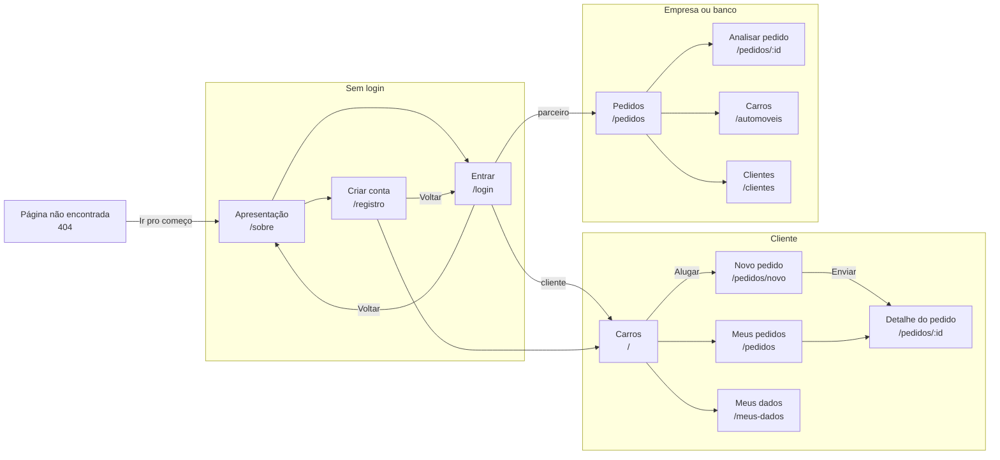
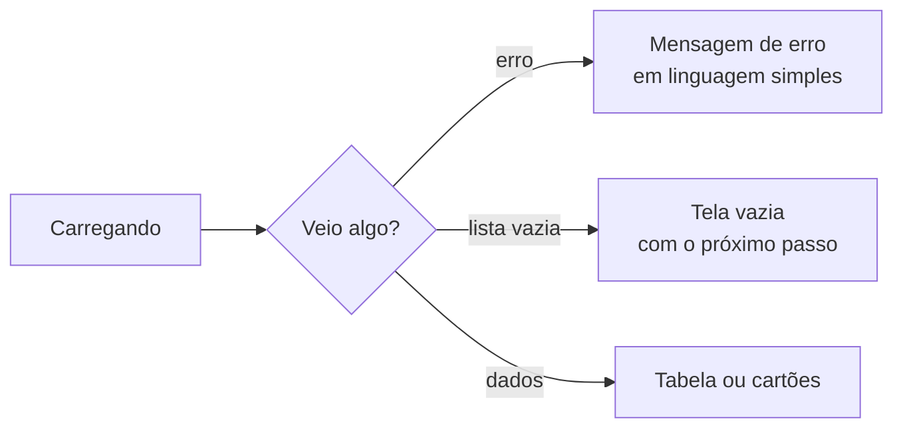

# Mapa de telas

Como as telas se ligam. As setas são os links e botões principais de cada uma.

```mermaid
flowchart LR
    subgraph Publico["Sem login"]
        SOBRE[Apresentação<br/>/sobre]
        LOGIN[Entrar<br/>/login]
        REG[Criar conta<br/>/registro]
    end

    subgraph Cliente["Cliente"]
        CAT[Carros<br/>/]
        NOVO[Novo pedido<br/>/pedidos/novo]
        PED[Meus pedidos<br/>/pedidos]
        DET[Detalhe do pedido<br/>/pedidos/:id]
        DADOS[Meus dados<br/>/meus-dados]
    end

    subgraph Parceiro["Empresa ou banco"]
        APED[Pedidos<br/>/pedidos]
        AVAL[Analisar pedido<br/>/pedidos/:id]
        CARROS[Carros<br/>/automoveis]
        CLI[Clientes<br/>/clientes]
    end

    SOBRE --> LOGIN
    SOBRE --> REG
    LOGIN -- Voltar --> SOBRE
    REG -- Voltar --> LOGIN
    LOGIN -- cliente --> CAT
    REG --> CAT
    LOGIN -- parceiro --> APED

    CAT -- Alugar --> NOVO
    NOVO -- Enviar --> DET
    PED --> DET
    CAT --> PED
    CAT --> DADOS

    APED --> AVAL
    APED --> CARROS
    APED --> CLI

    X[Página não encontrada<br/>404] -- Ir pro começo --> SOBRE
```

## Estados que toda tela trata

```mermaid
flowchart LR
    C[Carregando] --> V{Veio algo?}
    V -- erro --> E[Mensagem de erro<br/>em linguagem simples]
    V -- lista vazia --> Z[Tela vazia<br/>com o próximo passo]
    V -- dados --> T[Tabela ou cartões]
```
