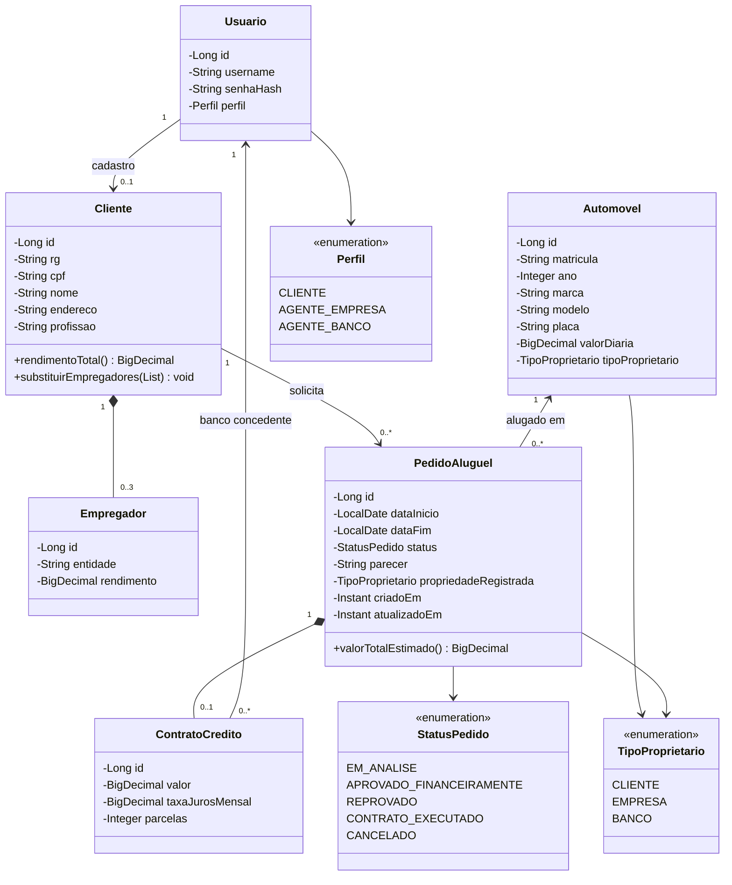
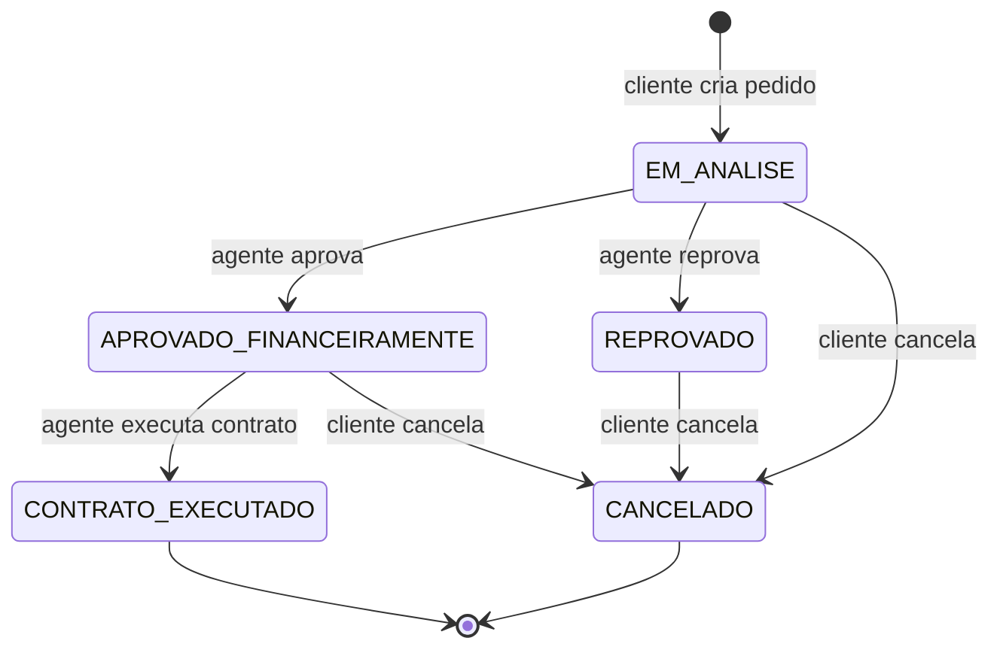

# Diagrama de Classes (domínio)

Reflete as entidades em `backend/src/main/java/br/com/aluguelcarro/model`.

```mermaid
classDiagram
    class Usuario {
        -Long id
        -String username
        -String senhaHash
        -Perfil perfil
    }
    class Cliente {
        -Long id
        -String rg
        -String cpf
        -String nome
        -String endereco
        -String profissao
        +rendimentoTotal() BigDecimal
        +substituirEmpregadores(List) void
    }
    class Empregador {
        -Long id
        -String entidade
        -BigDecimal rendimento
    }
    class Automovel {
        -Long id
        -String matricula
        -Integer ano
        -String marca
        -String modelo
        -String placa
        -BigDecimal valorDiaria
        -TipoProprietario tipoProprietario
    }
    class PedidoAluguel {
        -Long id
        -LocalDate dataInicio
        -LocalDate dataFim
        -StatusPedido status
        -String parecer
        -TipoProprietario propriedadeRegistrada
        -Instant criadoEm
        -Instant atualizadoEm
        +valorTotalEstimado() BigDecimal
    }
    class ContratoCredito {
        -Long id
        -BigDecimal valor
        -BigDecimal taxaJurosMensal
        -Integer parcelas
    }
    class Perfil {
        <<enumeration>>
        CLIENTE
        AGENTE_EMPRESA
        AGENTE_BANCO
    }
    class StatusPedido {
        <<enumeration>>
        EM_ANALISE
        APROVADO_FINANCEIRAMENTE
        REPROVADO
        CONTRATO_EXECUTADO
        CANCELADO
    }
    class TipoProprietario {
        <<enumeration>>
        CLIENTE
        EMPRESA
        BANCO
    }

    Usuario "1" --> "0..1" Cliente : cadastro
    Cliente "1" *-- "0..3" Empregador
    Cliente "1" --> "0..*" PedidoAluguel : solicita
    Automovel "1" <-- "0..*" PedidoAluguel : alugado em
    PedidoAluguel "1" *-- "0..1" ContratoCredito
    ContratoCredito "0..*" --> "1" Usuario : banco concedente
    Usuario --> Perfil
    PedidoAluguel --> StatusPedido
    Automovel --> TipoProprietario
    PedidoAluguel --> TipoProprietario
```

## Máquina de estados do pedido

```mermaid
stateDiagram-v2
    [*] --> EM_ANALISE : cliente cria pedido
    EM_ANALISE --> APROVADO_FINANCEIRAMENTE : agente aprova
    EM_ANALISE --> REPROVADO : agente reprova
    APROVADO_FINANCEIRAMENTE --> CONTRATO_EXECUTADO : agente executa contrato
    EM_ANALISE --> CANCELADO : cliente cancela
    APROVADO_FINANCEIRAMENTE --> CANCELADO : cliente cancela
    REPROVADO --> CANCELADO : cliente cancela
    CONTRATO_EXECUTADO --> [*]
    CANCELADO --> [*]
```
